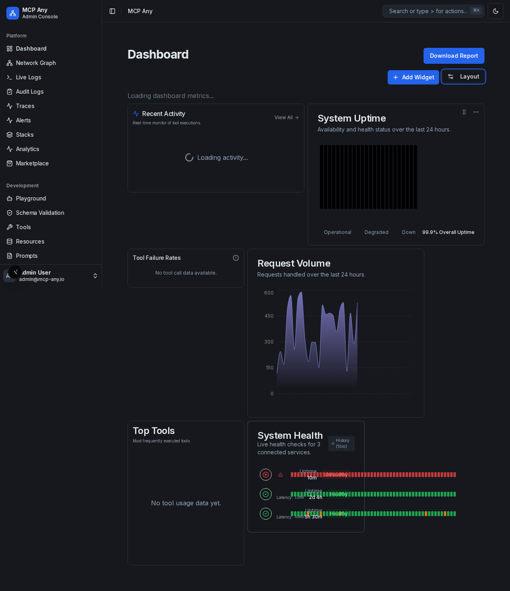

# Compact Density Mode

MCP Any Dashboard now supports a **Compact Density Mode** for users who prefer a higher information density or have smaller screens.

## Overview

By default, the dashboard uses a "Comfortable" layout with generous padding and spacing, optimizing for readability and touch targets. The "Compact" mode reduces padding, font sizes, and grid gaps to fit more information on the screen at once.

## How to Use

1.  Navigate to the **Dashboard**.
2.  Click the **Layout** button in the top-right corner.
3.  Under the **Density** section, select **Compact**.

The setting is automatically saved to your local browser storage and will persist across sessions.

## Changes

-   **Grid Gap**: Reduced from `gap-4` (16px) to `gap-2` (8px).
-   **Metrics Cards**: Reduced padding and font sizes.
-   **Lists (Activity/Health)**: Reduced row height and padding.
-   **Charts**: Optimized header spacing.

## Comparison

### Comfortable (Default)

### Compact

