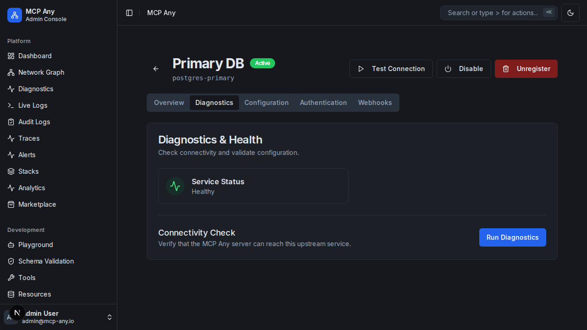
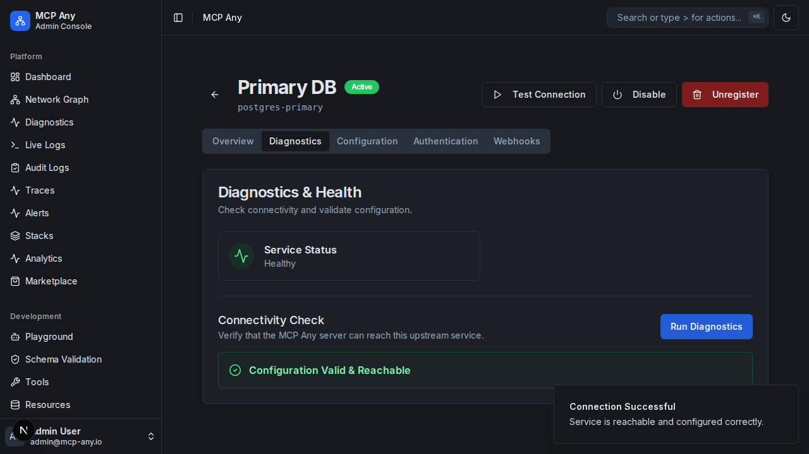

# Service Diagnostics

MCP Any provides a comprehensive diagnostics toolset to help you troubleshoot configuration and connectivity issues with your upstream services.

## Overview

The Diagnostics tab in the Service Detail view allows you to:
- Check the current operational status of the service.
- View the last known error message.
- Run real-time connectivity checks.
- Validate the service configuration against the schema.

## Features

### 1. Health Status
The Health Status card provides an immediate visual indicator of the service's health.
- **Healthy**: The service is running and reachable.
- **Error Detected**: The service has encountered an error (e.g., connection refused, timeout, or configuration error).

### 2. Connectivity Check
Clicking the "Run Diagnostics" button triggers a comprehensive check:
- **Static Validation**: Verifies that the configuration is syntactically correct and adheres to the schema.
- **Reachability Check**:
    - **HTTP/GraphQL/MCP**: Sends a request to the configured endpoint to ensure it is reachable.
    - **Filesystem**: Verifies that the configured root paths exist and are accessible.
    - **Command Line**: Verifies that the executable exists in the system PATH.

### 3. Configuration Validation
In the **Configuration** tab, you can use the "Validate" button to check your changes before saving. This prevents invalid configurations from being applied.

## Troubleshooting

If diagnostics fail, the error message will provide specific details, such as:
- `Connection refused`: The server is not running or the port is blocked.
- `Path does not exist`: The configured filesystem path is incorrect.
- `Command not found`: The executable is not installed or not in the PATH.
