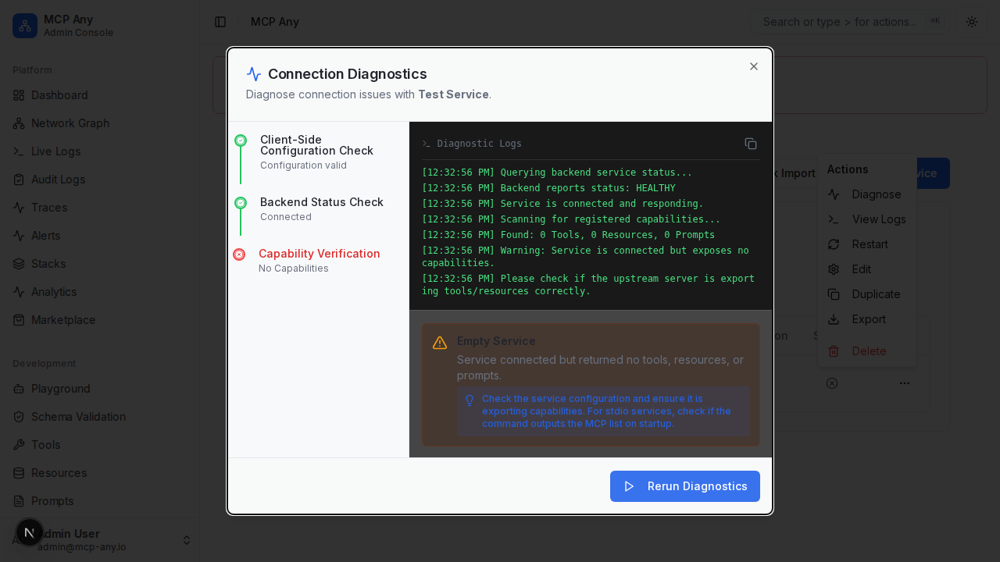

# Connection Diagnostics

MCP Any provides a built-in troubleshooting tool to diagnose connection issues with upstream services.

## Capability Verification

When a service is connected ("Healthy"), it is expected to expose tools, resources, or prompts. A common issue is a service that connects successfully (TCP/HTTP) but fails to export any capabilities due to configuration errors or internal logic.

The **Capability Verification** step in the Diagnostics dialog automatically scans the connected service for:
- Registered Tools
- Registered Resources
- Registered Prompts

If no capabilities are found, the diagnostics will warn you and suggest checking the service configuration.

