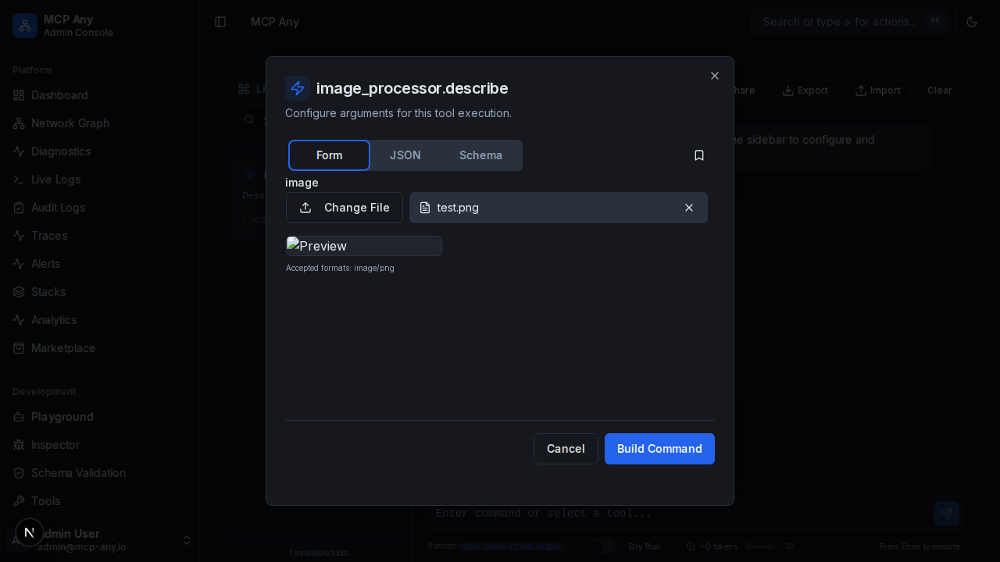

# Image Preview in Playground

## Overview

The Playground now provides instant visual feedback when uploading image files. When a user selects or drags an image file into a file input field (typically for tools accepting base64 encoded images), a preview of the image is displayed immediately.

This enhances the user experience by confirming that the correct image has been selected before executing the tool.

## Key Features

- **Instant Preview**: Automatically renders a preview for image files (PNG, JPEG, WEBP, etc.).
- **Drag and Drop**: Supports dragging image files directly onto the input area.
- **Visual Confirmation**: Helps prevent errors by showing exactly what will be sent to the model.

## Screenshot

