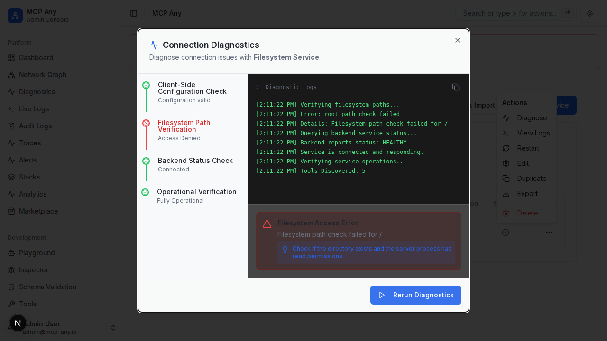

# Filesystem Connection Diagnostics

The Filesystem Connection Diagnostic tool helps you verify that your configured filesystem roots are accessible by the MCP Any server.

## Problem
Configuring a filesystem service involves mapping virtual paths to local paths. If a local path is incorrect, missing, or has restricted permissions, the service might fail silently or refuse to start.

## Solution
The Connection Diagnostic tool now includes a specific "Filesystem Path Verification" step. This step:
1.  Sends the current configuration to the backend for validation.
2.  Checks if the path exists.
3.  Checks if the path is readable by the server process (verifying permissions).
4.  Reports specific errors if any check fails.

## Screenshot

## How to Use
1.  Go to the **Services** page.
2.  Locate your Filesystem service.
3.  Click the **Actions** menu (three dots) and select **Diagnose** (or click the alert icon if an error is present).
4.  Click **Start Diagnostics**.
5.  Review the "Filesystem Path Verification" step.
