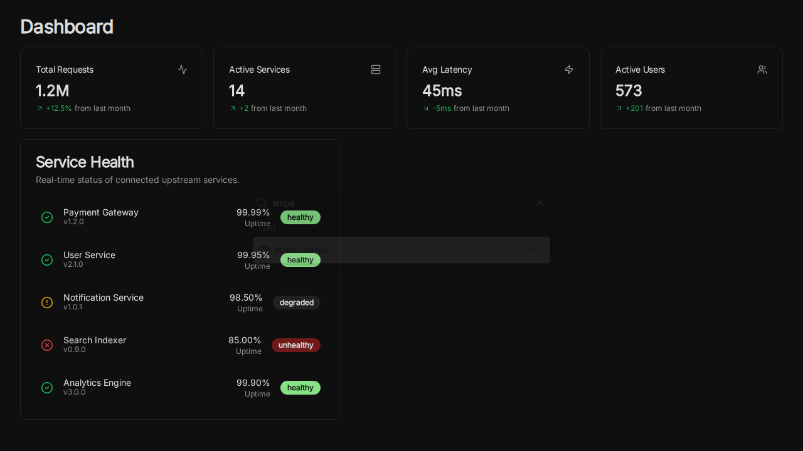

# Global Search (Cmd+K)

The Global Search feature allows users to quickly navigate between pages and find specific tools or services using the `Cmd+K` (or `Ctrl+K`) shortcut.

## Features

- **Keyboard Shortcut**: Press `Cmd+K` (Mac) or `Ctrl+K` (Windows/Linux) to open the search palette.
- **Navigation**: Jump to Dashboard, Services, Tools, etc.
- **Tools Search**: Search for specific tools like `stripe_charge` or `get_user`.
- **Actions**: Trigger actions like creating a new service or reloading the window.

## Implementation

- **Component**: `CommandMenu` in `ui/src/components/command-menu.tsx`.
- **Library**: Built using `cmdk` and Shadcn UI components.
- **Integration**: Added to `ui/src/app/layout.tsx` to be available globally.

## Screenshot

