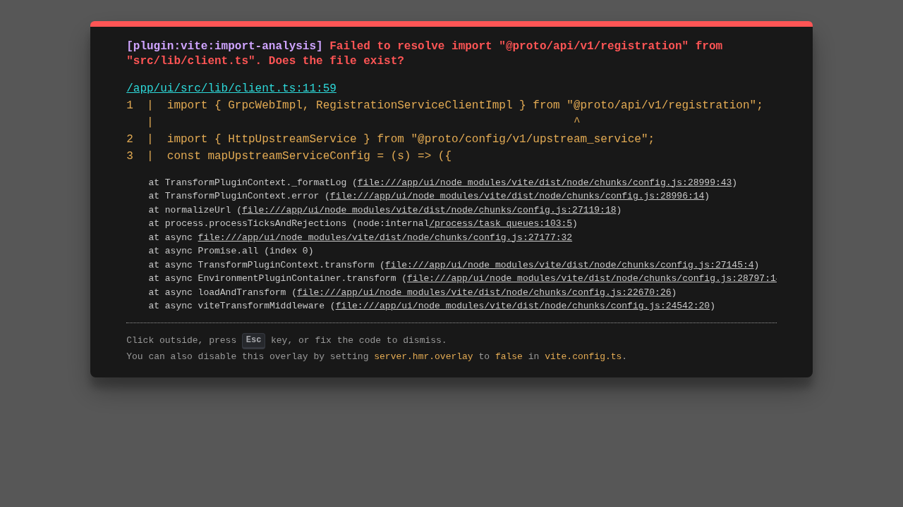

# Middleware Pipeline

**Status:** Implemented

## Goal
Configure the interceptors and processing steps that occur between the client and upstream servers. Middleware components handle cross-cutting concerns like Authentication, Rate Limiting, and Logging.

## Usage Guide

### 1. Visual Pipeline
Navigate to `/middleware`. The interface visualizes the request flow from left to right.

### 2. Reorder Pipeline
Change the execution order of middleware components. For example, moving **Logging** before **Auth** will log even rejected unauthenticated requests. Use the up and down arrows on the pipeline visualizer to reorder the pipeline.
