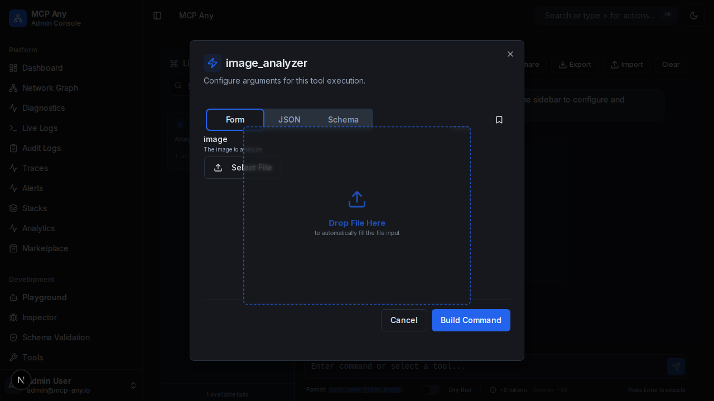
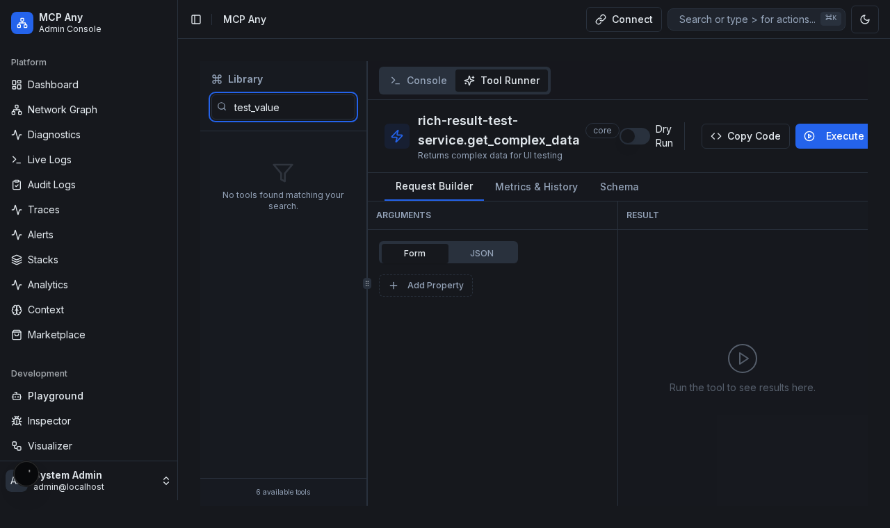

# Native File Upload in Playground

## Overview

The Playground now supports native file uploads for tool inputs that require base64 encoded data.

Previously, users had to manually encode files to base64 strings and paste them into the input fields. With this feature, if the tool schema defines a field with `contentEncoding: "base64"` or `format: "binary"`, the Playground renders a file input component.

## How it works

1.  **Schema Detection**: The `SchemaForm` component detects fields with `contentEncoding: "base64"`.
2.  **File Selection**: Users can click "Select File" to choose a file from their device.
3.  **Automatic Encoding**: The selected file is automatically read and converted to a base64 string.
4.  **Submission**: The base64 string is populated in the form data and sent to the tool execution API.

## Drag and Drop Support

To further streamline the workflow, you can now drag and drop a file anywhere onto the tool configuration form.

### How to use

1.  Open a tool that accepts file inputs.
2.  Drag a file from your operating system into the browser window.
3.  An overlay "Drop File Here" will appear.
4.  Drop the file to automatically fill the matching file input field.



## Example Schema

```json
{
  "type": "object",
  "properties": {
    "image": {
      "type": "string",
      "contentEncoding": "base64",
      "contentMediaType": "image/png",
      "description": "The image to analyze"
    }
  }
}
```

## Screenshot


