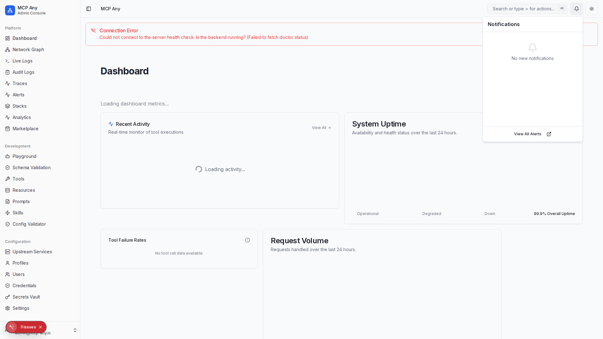

# Notification Center

The Notification Center provides a centralized hub for viewing and managing system alerts and notifications directly from the top navigation bar.

## Features

- **Real-time Alerts**: Automatically polls for new alerts every 30 seconds.
- **Badge Count**: Visual indicator (red badge) for the number of active, unread notifications.
- **Quick Access**: View the 5 most recent alerts without leaving your current context.
- **Severity Indicators**: Visual icons distinguishing between Critical, Warning, and Info alerts.
- **Mark as Read**: Quickly acknowledge alerts directly from the dropdown.
- **Empty State**: Friendly empty state when there are no new notifications.

## Usage

1.  Click the **Bell Icon** in the top right header.
2.  Review recent alerts.
3.  Click the **Checkmark** icon on an alert to mark it as acknowledged (read).
4.  Click **View All Alerts** to navigate to the full Alerts page for detailed management.

## Visuals

