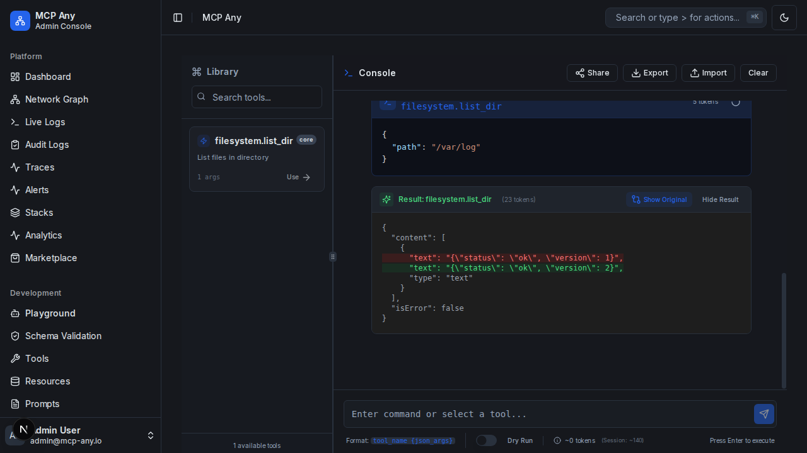

# Playground Tool Output Diffing

The **Tool Output Diffing** feature in the Playground allows you to compare the result of a tool execution with the previous execution of the same tool (with identical arguments). This is essential for debugging changes in API responses, state mutations, or tracking non-deterministic behavior.

## Key Features

-   **Automatic Detection**: Automatically detects when you run the same tool with the same arguments consecutively (or later in the session).
-   **One-Click Comparison**: A "Compare Previous" button appears on the latest result card.
-   **Visual Diff**: Highlights added (green) and removed (red) lines in a unified diff view.
-   **JSON Aware**: Uses intelligent JSON diffing to show structural changes rather than just text differences.

## Usage

1.  Select a tool from the sidebar or type a command in the Playground.
2.  Run the tool (e.g., `get_user_status {"id": 123}`).
3.  Observe the result.
4.  Run the tool again (e.g., after changing the user state in the backend).
5.  On the new result card, click the **"Compare Previous"** button.
6.  The result view will toggle to show the differences between the two executions.

