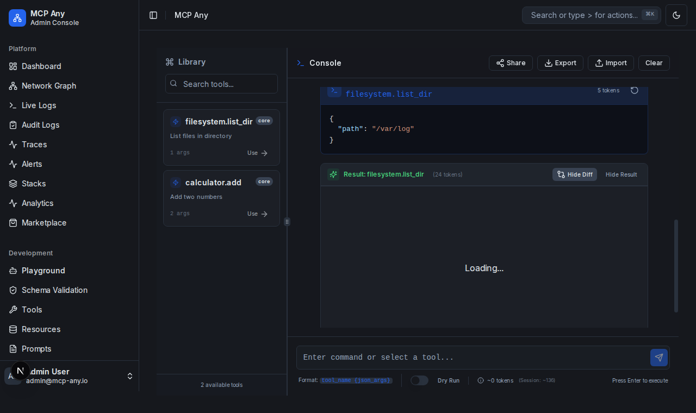

# Playground Tool Output Diffing

MCP Any Playground now supports diffing the output of tool executions. When you run the same tool multiple times with the same arguments, the Playground will automatically detect if the result has changed and offer a "Show Diff" option.

## Features

- **Automatic Detection**: Checks if the previous execution of the same tool with the same arguments produced a different result.
- **Visual Diff**: Displays a side-by-side or inline diff using the Monaco Editor diff view.
- **History Aware**: Works across your current session history.

## Usage

1.  Navigate to the **Playground**.
2.  Execute a tool (e.g., `filesystem.list_dir`).
3.  Execute the same tool again with the same arguments.
4.  If the output is different (e.g., a file was added), a **Show Diff** button will appear in the result header.
5.  Click **Show Diff** to view the changes.

