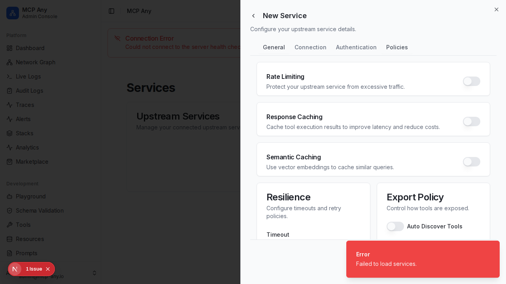

# Service Policies

MCP Any allows you to configure advanced policies for your upstream services to ensure performance, reliability, and cost control.

## Rate Limiting

Protect your upstream services from excessive traffic by configuring rate limits.

- **Requests Per Second**: The maximum number of requests allowed per second.
- **Burst Capacity**: Allow short bursts of traffic above the limit.
- **Storage**: Choose between In-Memory (fast, local) or Redis (distributed).
- **Limit By**: Apply limits globally, per IP, per User, or per API Key.

## Caching

Improve latency and reduce costs by caching tool execution results.

- **TTL**: Time-to-live for cached entries (e.g., `60s`, `5m`).
- **Strategy**: Eviction strategy (`LRU`, `LFU`).

### Semantic Caching

Use vector embeddings to cache similar queries, even if the exact input differs.

- **Similarity Threshold**: Control how close the match must be (0.0 - 1.0).
- **Providers**: Support for OpenAI, Ollama, and custom HTTP embedding services.

## Resilience

Configure circuit breakers and timeouts to handle failures gracefully.

- **Timeout**: Maximum duration for a request before it is cancelled.
