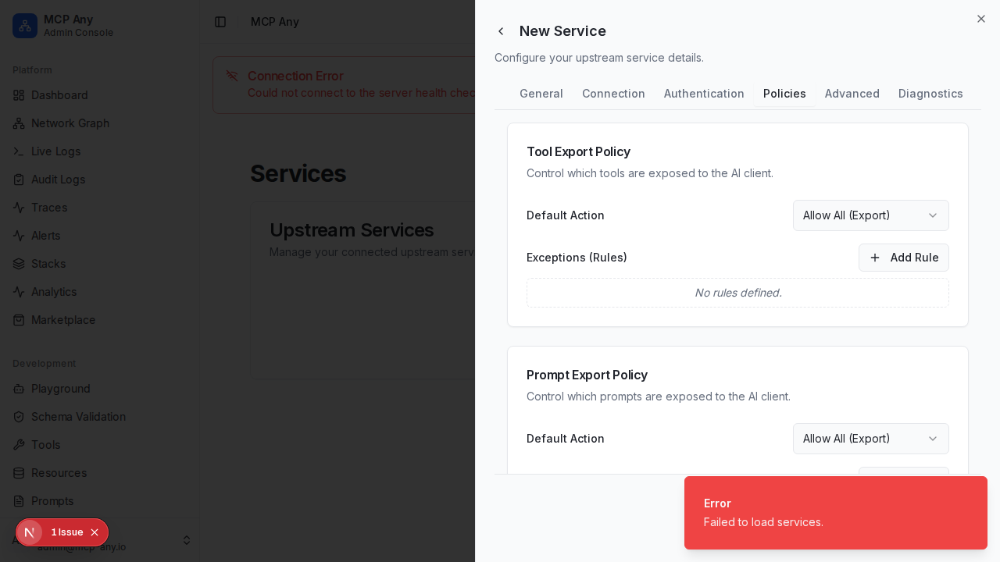

# Granular Tool Export Policies

MCP Any now supports granular control over which tools, prompts, and resources are exposed to the AI client. This is a critical security feature for enterprise deployments, allowing administrators to define Allow/Deny lists using regex patterns.

## Features

- **Default Action**: Set the default behavior to "Allow All" (Export) or "Deny All" (Unexport).
- **Regex Rules**: Define exception rules using Regular Expressions.
- **Granular Control**: Separate policies for Tools, Prompts, and Resources.

## Usage

1. Navigate to the **Services** page.
2. Edit an existing service or create a new one.
3. Go to the **Policies** tab.
4. Configure the **Tool Export Policy**, **Prompt Export Policy**, and **Resource Export Policy**.

### Example: Deny dangerous tools

To allow all tools except those starting with `delete_`:

1. set **Default Action** to **Allow All (Export)**.
2. Add a Rule:
   - **Regex**: `^delete_.*`
   - **Action**: **Deny (Unexport)**

