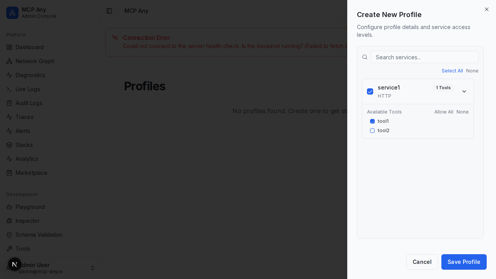

# Profile Tool Permissions

MCP Any allows you to define granular tool permissions within your profiles. This feature enables you to control exactly which tools are exposed to AI agents, enhancing security and safety.

## Configuration

When editing a profile, you can now expand the enabled services to configure specific tool access.

### Features

-   **Allow All / None**: Quickly enable or disable all tools for a service.
-   **Granular Selection**: Select individual tools to be allowed in the profile.
-   **Default Safe**: If no tools are selected, the service behaves as if it has no tools enabled (or allows all if "Allow All" logic is active - currently defaults to "All" if configuration is empty, but selecting specific tools creates an allowlist).

## Usage

1.  Navigate to **Settings > Profiles**.
2.  Create a new profile or edit an existing one.
3.  Select a service (e.g., `filesystem`).
4.  Click the expand arrow (>) next to the service name.
5.  Uncheck "Allow All" (if applicable) or simply uncheck specific tools you wish to restrict.
6.  Save the profile.

AI agents connecting with this profile will only see and be able to execute the allowed tools.
