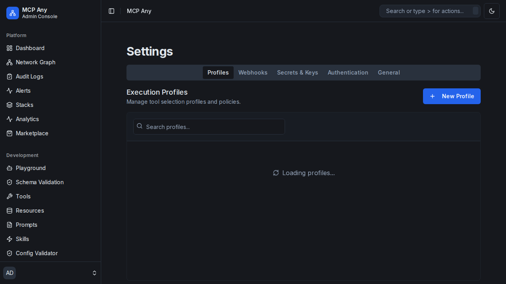

# Profile Management

MCP Any allows you to define **Execution Profiles** to control which tools are available to AI models based on the context.

## Overview

Profiles act as filters that dynamically select a subset of tools based on **Tags** and **Tool Properties**.

## Features

- **Create Profiles**: Define new profiles with unique names.
- **Dynamic Selection**:
  - **Tags**: Auto-include tools that have specific tags (e.g., `production`, `verified`).
  - **Tool Properties**: Filter tools based on their properties (e.g., `read_only=true`).
- **Management**: Edit or delete existing profiles.

## Usage

1. Navigate to **Settings > Profiles**.
2. Click **+ New Profile**.
3. Enter a name (e.g., `safe-mode`).
4. Add selector tags (e.g., `safe`).
5. Add tool property matchers (e.g., `risk_level=low`).
6. Save the profile.

When starting an MCP client, you can specify this profile to ensure only safe tools are exposed.
