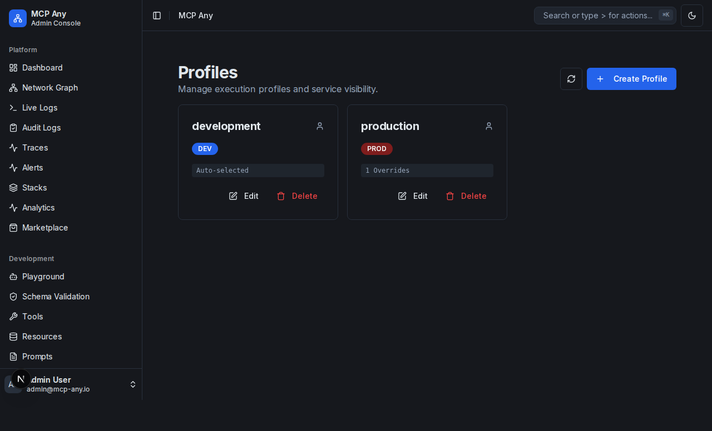
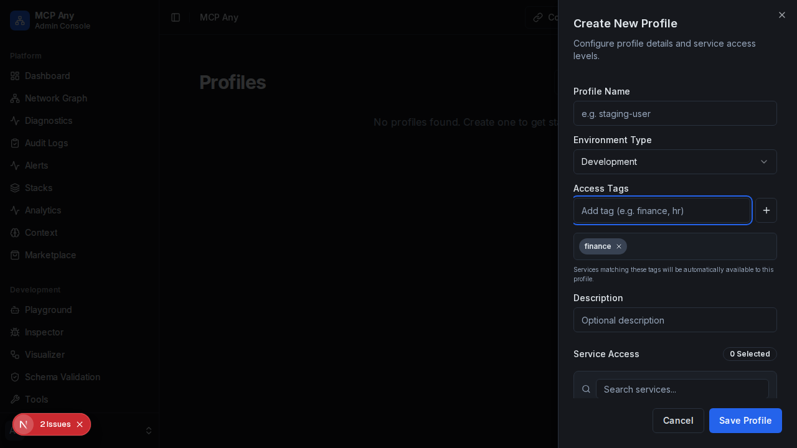

# Profiles

Profiles allow you to define execution contexts with specific service visibility and configuration overrides. This enables you to create distinct environments like "Development", "Production", or "Debug" within the same MCP Any instance.

## Managing Profiles

Navigate to **Configuration > Profiles** in the sidebar to view and manage your profiles.

### Creating and Editing Profiles

Click "Create Profile" or the "Edit" button on an existing profile card to open the Profile Editor.

In the editor, you can:
- **Name**: Give your profile a unique name (e.g., `staging-api`).
- **Tags**: Define which services are automatically included based on their tags (e.g., `staging`, `common`).
- **Service Configuration**: Explicitly enable or disable specific services, overriding the tag-based selection.

### Service Overrides

The "Service Configuration" table allows you to fine-tune service availability:
- **Default (Auto)**: The service is enabled if it matches the profile's tags.
- **Force Enable**: The service is always enabled for this profile, even if tags don't match.
- **Force Disable**: The service is always disabled for this profile.
