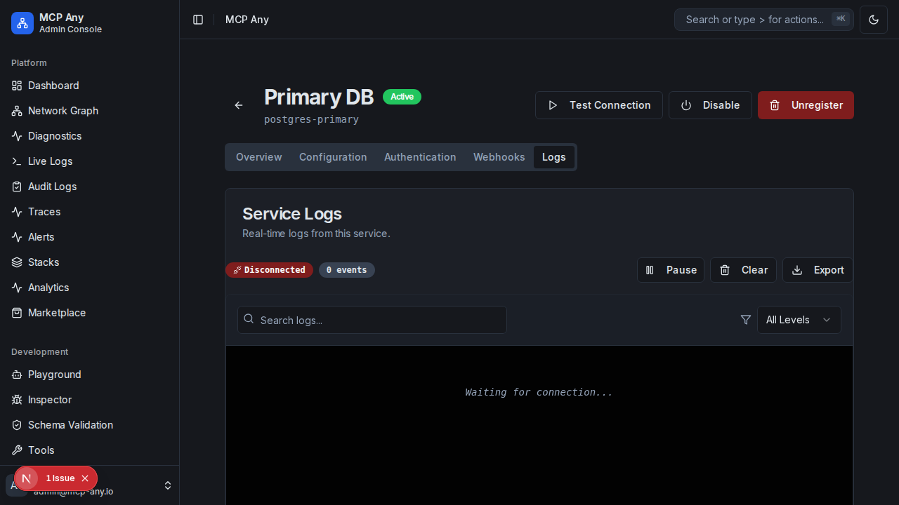

# Contextual Service Logs

**Status:** Implemented

## Goal
Provide immediate visibility into the runtime logs of a specific upstream service without leaving the configuration context. This allows operators to debug connection errors, authentication failures, and runtime exceptions efficiently.

## Features

- **Embedded Log Stream**: View real-time logs directly within the Service Detail page.
- **Auto-Filtering**: Logs are automatically filtered to show only events from the current service.
- **Search & Highlight**: Quickly find specific error messages or request IDs.

## Usage

1. Navigate to **Services**.
2. Click on a service to view its details.
3. Select the **Logs** tab.

## Troubleshooting with Logs

The Logs tab is the first place to check if a service is "Unhealthy" or if "Test Connection" fails.

- **Connection Refused**: Indicates the backend cannot reach the upstream service address.
- **Authentication Failed**: Check the "Authentication" tab to ensure credentials are valid.
- **Stderr Output**: For command-line services, standard error output is streamed here in real-time.
