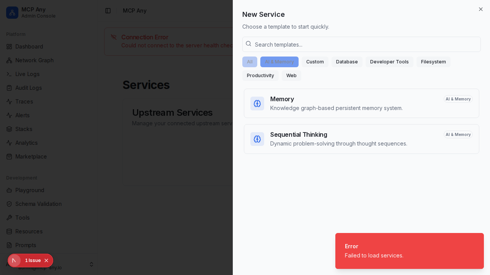

# Service Templates

MCP Any provides a rich library of service templates to help you get started quickly with popular MCP servers.

## Overview

The Service Template Selector allows you to browse and configure upstream services from a curated list of community and official MCP servers.

## Features

- **Categorized Library**: Templates are organized into categories like "AI & Memory", "Productivity", "Web", "Database", and "Developer Tools".
- **Search**: Quickly find the template you need with real-time search.
- **Pre-configured Commands**: Templates come with the correct `npx` or CLI commands pre-filled.
- **Environment Variable Prompts**: Easy-to-use form fields for required secrets (e.g., API Keys, Tokens).

## Available Templates

### AI & Memory
- **Memory**: Knowledge graph-based persistent memory system (`@modelcontextprotocol/server-memory`).
- **Sequential Thinking**: Dynamic problem-solving through thought sequences (`@modelcontextprotocol/server-sequential-thinking`).

### Productivity
- **Slack**: Connect your AI to Slack for channel management and messaging (`@modelcontextprotocol/server-slack`).

### Web
- **Google Maps**: Access location services and place details (`@modelcontextprotocol/server-google-maps`).
- **Brave Search**: Perform web searches (`@modelcontextprotocol/server-brave-search`).
- **Puppeteer**: Browser automation and scraping (`@modelcontextprotocol/server-puppeteer`).

### Database
- **PostgreSQL**: Connect to PostgreSQL databases.
- **SQLite**: Connect to SQLite databases.

### Developer Tools
- **GitHub**: Integrate with GitHub API.
- **Everything**: A reference server showcasing various MCP capabilities.
