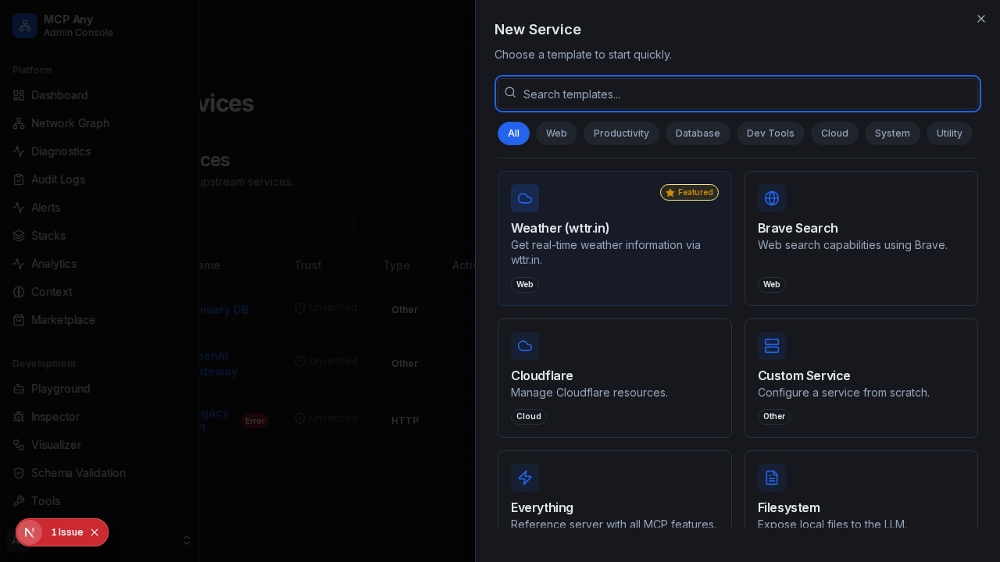

# Slack Integration

Connect your AI assistants to Slack workspaces with just a few clicks using the built-in Slack Service Template.

## Overview

The Slack integration allows LLMs to interact with Slack channels, read messages, and post updates. This is powered by the `@modelcontextprotocol/server-slack` running as an upstream service managed by MCP Any.

## Configuration

1.  Navigate to **Services**.
2.  Click **Add Service**.
3.  Select **Slack** from the template list.
4.  Enter your **Slack Bot Token** (`xoxb-...`).
    - You can obtain this token by creating an app in the [Slack API Portal](https://api.slack.com/apps).
5.  Click **Save**.

## Capabilities

Once connected, your AI agents will have access to tools such as:
- `slack.list_channels`: List public channels.
- `slack.post_message`: Send a message to a channel.
- `slack.read_history`: Read messages from a channel.

## Troubleshooting

- Ensure your Slack App has the necessary scopes (e.g., `channels:read`, `chat:write`, `history:read`).
- Verify the Bot Token starts with `xoxb-`.
