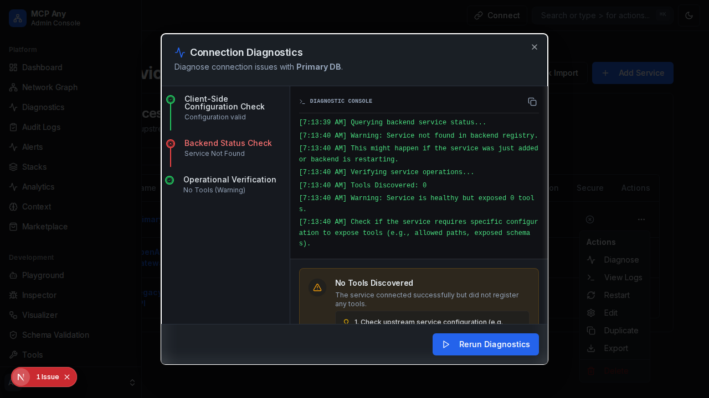
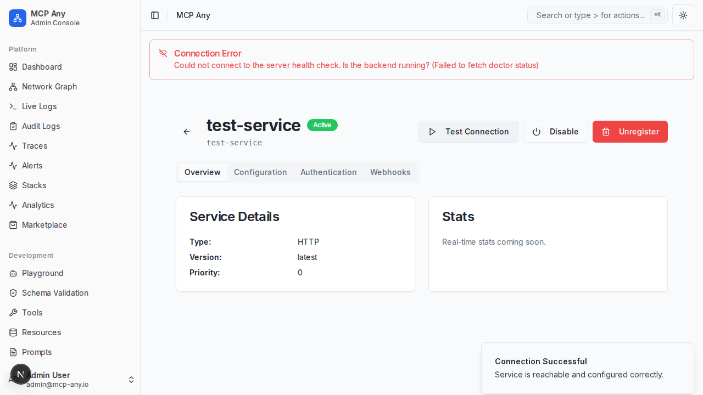

# Test Connection & Health Diagnostics (Doctor 2.0)

MCP Any provides a built-in "Test Connection" feature for upstream services, enhanced with "Doctor 2.0" diagnostics. This allows you to verify that your configuration (addresses, credentials, file paths, commands) is correct and the service is reachable before enabling it or when troubleshooting issues.

## How to use

1.  Navigate to **Upstream Services** in the sidebar.
2.  Click on the service you want to test.
3.  In the service detail header, click the **Test Connection** button (play icon).

The system will attempt to connect to the service or verify the configuration resources and display the result.

## Enhanced Diagnostics (Doctor 2.0)

The diagnostics system performs a multi-step verification process:

1.  **Client-Side Configuration Check**: Validates that all required fields are present and correctly formatted (e.g., Zod schema validation).
2.  **Backend Status Check**: Verifies that the service is registered and running in the backend.
3.  **Operational Verification**: Performs a live check of the service's capabilities:
    *   Verifies that tools/resources/prompts can be listed.
    *   Checks the count of available capabilities.
    *   Analyzes the last error message for specific known issues (e.g., Module Not Found, Permission Denied).

## Supported Checks

*   **HTTP / GraphQL**: Performs a reachability check (HEAD/GET request) to the configured address.
*   **Filesystem**: Verifies that the configured root paths exist and are accessible by the server.
*   **Command Line / Stdio**: Verifies that the command executable exists in the system PATH or at the absolute path provided, and that the working directory exists.
*   **MCP Remote**: Verifies reachability of the HTTP endpoint or existence of the Stdio command.
*   **Operational Health**: Checks if the service is actually returning tools and responding to requests, not just connecting.

## Troubleshooting Common Errors

The system can automatically identify specific error types:
*   **Schema Validation Errors**: Incorrect configuration formats.
*   **Filesystem Permissions**: "EACCES" errors when accessing directories.
*   **Missing Modules**: "MODULE_NOT_FOUND" when node scripts fail to run.
*   **Empty Tool Lists**: Services that connect but fail to expose any functionality.

## Screenshot

### Diagnostics Failure Example
Below is an example of the diagnostics dialog reporting a failure during the operational verification stage.

### Successful Connection

