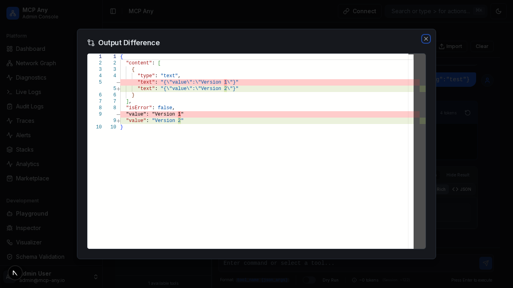

# Tool Output Diffing

**Status:** Planned (Upcoming)

MCP Any is designing support for visual diffing for tool execution results. When you execute a tool multiple times with the same arguments, the Playground will automatically detect if the output has changed compared to the previous execution.

## Planned Workflow

1.  **Execute a Tool**: Run any tool in the Playground.
2.  **Re-execute**: Run the same tool again with the exact same arguments.
3.  **Detect Changes**: If the output differs from the previous run, a "Show Changes" button will appear next to the result.
4.  **Visualize Diff**: Click the button to open a side-by-side diff view showing exactly what changed.

## Screenshot

*(Mockup)*

## Intended Benefits

-   **Debugging**: Quickly identify why a tool is returning different data.
-   **Verification**: Ensure that changes to upstream services are having the intended effect.
-   **Monitoring**: Spot intermittent issues or data drift.
