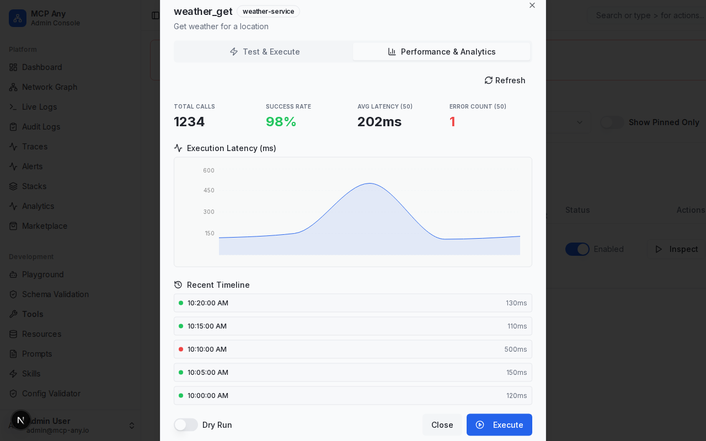

# Tool Performance Analytics

MCP Any provides real-time and historical analytics for every tool. This helps developers and operators understand usage patterns, performance bottlenecks, and error rates.

## Live Metrics

The "Performance & Analytics" tab in the Tool Inspector provides a comprehensive view of tool execution:

- **Total Calls**: The total number of times this tool has been executed (all-time).
- **Success Rate**: The percentage of successful executions (all-time).
- **Avg Latency**: The average execution time of the last 50 calls.
- **Error Count**: The number of failed executions in the last 50 calls.

## Execution Latency Graph

A visualization of execution latency over time allows you to spot performance degradation or spikes.

## Recent Timeline

A chronological list of recent executions, showing timestamp, status, and duration for quick debugging.
