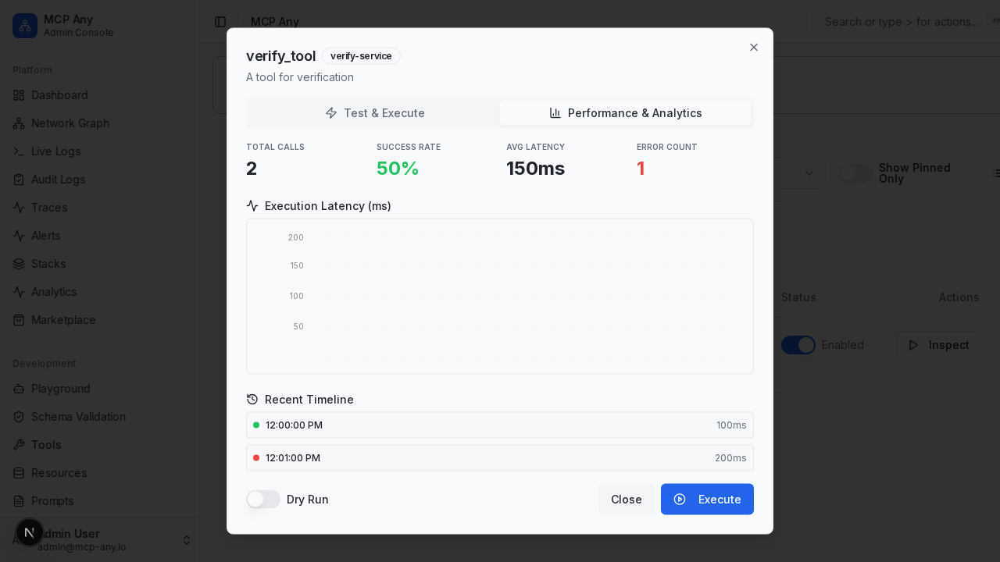

# Tool Metrics & Analytics

The **Tool Inspector** now provides comprehensive historical metrics and analytics for each tool. This feature allows you to diagnose performance issues, track usage trends, and monitor success rates over time.

## Key Features

*   **Historical Execution Data**: View the history of tool executions, including latency and status.
*   **Performance Metrics**: Real-time calculation of:
    *   **Total Calls**: Total number of executions recorded.
    *   **Success Rate**: Percentage of successful executions.
    *   **Avg Latency**: Average execution time in milliseconds.
    *   **Error Count**: Total number of failed executions.
*   **Visualization**: Interactive area chart showing latency trends over time.

## How to Access

1.  Navigate to the **Tools** page.
2.  Click the **Inspect** button (terminal icon) on any tool.
3.  Switch to the **Performance & Analytics** tab.

## Screenshot

