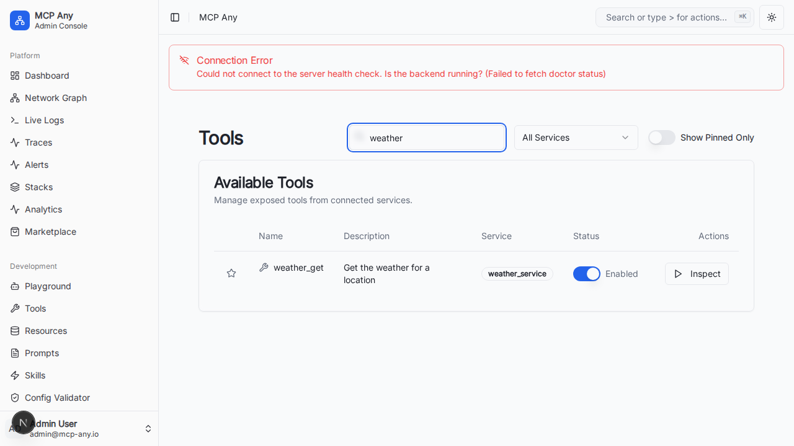

# Tool Search Bar (Smart Search)

The **Smart Tool Search Bar** provides a quick and efficient way to find specific tools within the MCP Any management dashboard, featuring autocomplete and history.

## Overview

As the number of connected services and tools grows, finding a specific tool can become difficult. The Smart Tool Search Bar allows users to filter the list of available tools by name or description instantly, and provides quick access to recently used tools.

## Key Features

-   **Real-time Filtering**: The list of tools updates instantly as you type.
-   **Autocomplete**: Suggestions appear in a dropdown menu based on your query.
-   **Recent Tools**: Quickly access your most recently selected tools from the search dropdown.
-   **Service Context**: Displays the service ID for each tool to distinguish between similarly named tools.

## Usage

1.  Navigate to the **Tools** page in the dashboard.
2.  Click on the **Search tools...** input field in the toolbar.
3.  **Recent Tools**: Before typing, you will see a list of recently used tools.
4.  **Search**: Type a keyword (e.g., "weather", "calculator").
5.  Select a tool from the dropdown or view the filtered list below.

## Visuals

## Technical Details

-   **Filtering Logic**: The search is performed client-side on the currently loaded list of tools using a high-performance index.
-   **Fields Searched**: Matches against `name`, `description`, and `serviceId` (case-insensitive).
-   **Persistence**: Recent tools are stored locally for quick access across sessions.
-   **Combination**: Works in conjunction with the "Filter by Service" and "Show Pinned Only" filters.
