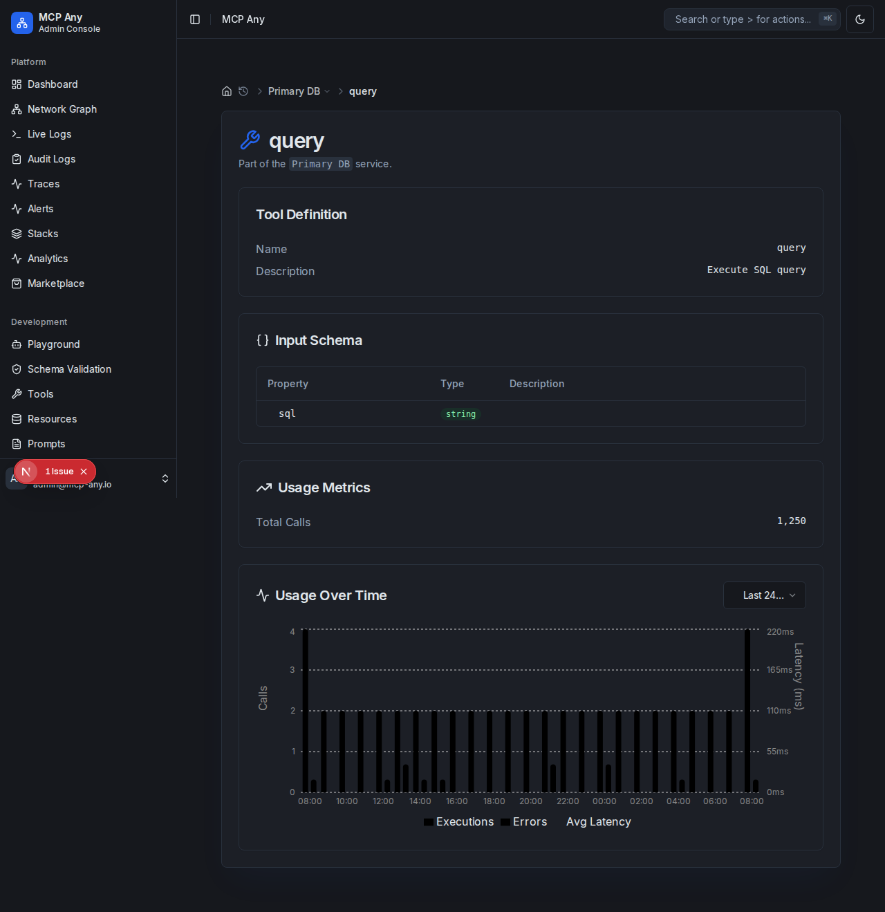

# Tool Usage Graph

**Visualizing Tool Performance and Usage Patterns**

The Tool Detail view now includes an interactive **Usage Over Time** graph, providing valuable insights into how your tools are being utilized.

## Key Features

- **Execution Count**: View the number of tool executions over time (hourly, daily).
- **Latency Tracking**: Monitor average and maximum latency to identify performance bottlenecks.
- **Error Visualization**: Quickly spot error spikes (color-coded in red).
- **Time Range Selection**: Filter data by "Last Hour", "Last 24 Hours", or "Last 7 Days".

## How to Use

1. Navigate to **Services**.
2. Select a service to view its details.
3. Click on a **Tool** from the tools list.
4. Scroll down to view the **Usage Metrics** and the new **Usage Over Time** chart.
