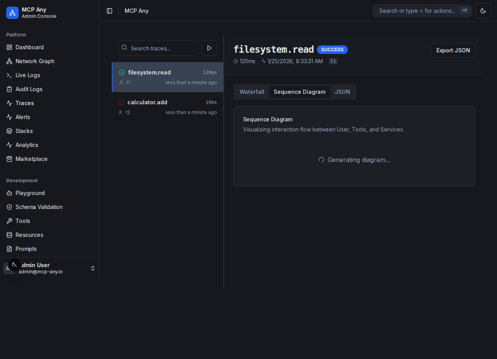

# Trace Sequence Diagram

The Trace Sequence Diagram provides a visualization of the interaction flow between the User, MCP Core, Services, and Tools within a trace.

## Overview

While the Execution Waterfall view is excellent for analyzing latency and timing, the Sequence Diagram helps you understand the logical flow of messages and dependencies. It shows:

- **Actors**: Vertical lifelines representing the User, MCP Core, Services, and Tools.
- **Messages**: Arrows representing requests and responses between actors.
- **Order**: The sequence of operations from top to bottom.

## Usage

1. Navigate to the **Traces** page.
2. Select a trace from the list to view its details.
3. Click on the **Sequence** tab (next to Overview).

## Screenshot

## Key Features

- **Actor Identification**: Automatically identifies and groups spans by Service or Tool.
- **Visual Flow**: Clearly shows the request/response cycle.
- **Error Visualization**: Failed calls are highlighted in red.
