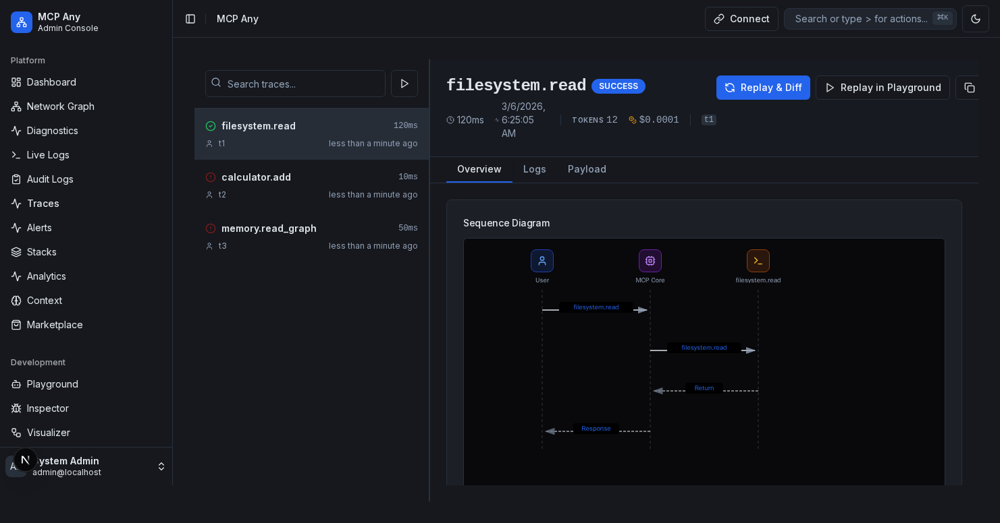
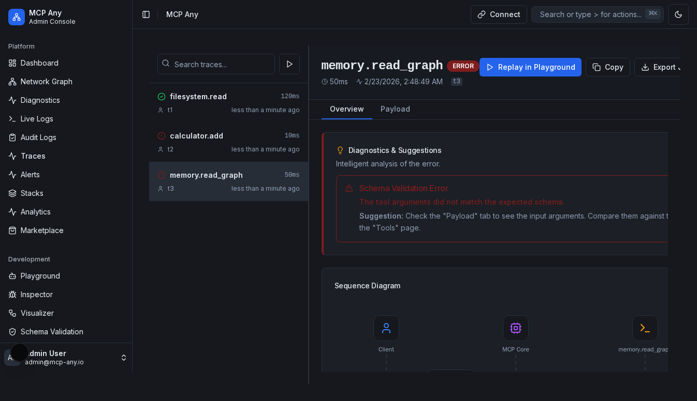

# Inspector (Live Traces)

**Status:** Implemented

## Goal

Debug complex interactions by inspecting the full lifecycle of MCP requests. The Inspector allows you to examine payloads, timing, errors, and sequence diagrams for every tool call and API request.

## Usage Guide

### 1. Inspector Dashboard

Navigate to `/inspector`. This view shows a real-time, virtualized table of all system activity, powered by WebSockets.

- **Search & Filter**: Use the toolbar to search traces by ID or Name, and filter by Status (Success, Error, Pending) or Type (Tool, Service, Core, Resource).
- **Status Icons**: Green check for success, Red X for failure.
- **Duration**: Time taken for the request to complete.
- **Live Controls**: Pause/Resume live updates, Clear traces, or manually Refresh.
- **Seed Trace**: Inject a complex test trace to verify inspector functionality.

### 2. Trace Detail

Click on any row in the trace list to open the **Detail View** in a slide-out sheet.
This view is split into tabs:

- **Overview**: Shows diagnostics, a sequence diagram, an execution waterfall, and raw input/output.
- **Logs**: Displays centralized logs correlated with this specific trace.
- **Payload**: The raw JSON request and response payloads.

### 3. Replay & Diff

To quickly reproduce a bug or test a tool:

1. Open a trace detail.
2. Click **"Replay & Diff"** to re-run the exact tool with the same arguments and visually compare the new output against the original trace output.
3. Alternatively, click **"Replay in Playground"** to open the arguments in the Interactive Playground for manual editing.

### 4. Export & Share

To share a trace with your team or attach it to a bug report:

- **Copy**: Click the **Copy** button to copy the full trace JSON to your clipboard.
- **Export JSON**: Click **Export JSON** to download the trace as a `.json` file.

### 5. Smart Diagnostics

When a trace contains an error (e.g., Schema Validation Error, Connection Refused), the inspector automatically analyzes the failure and provides a **Diagnostics & Suggestions** card.

This feature detects common issues like:

- **Schema Validation Errors**: Input arguments mismatching the tool definition.
- **Permission Errors**: File system access denied.
- **JSON Errors**: Invalid JSON payloads.
- **Timeouts**: Operations taking too long.
- **Connection Failures**: Upstream services being unreachable.
