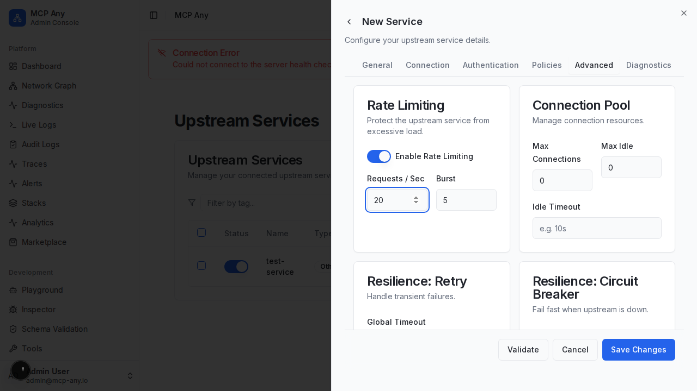

# Traffic Policy Configuration

MCP Any provides advanced traffic policy controls to ensure the stability, reliability, and security of your upstream services.

## Overview

The Traffic Policy editor allows you to configure:

*   **Rate Limiting**: Protect your upstream services from being overwhelmed.
*   **Connection Pooling**: optimize resource usage.
*   **Resilience**: Implement circuit breakers and retry policies to handle failures gracefully.

## Features

### Rate Limiting

*   **Requests Per Second (RPS)**: The maximum number of requests allowed per second.
*   **Burst Capacity**: The number of requests allowed to exceed the limit in a short burst.

### Connection Pooling

*   **Max Connections**: The maximum number of concurrent connections to the upstream service.
*   **Max Idle Connections**: The number of idle connections to keep open for reuse.
*   **Idle Timeout**: How long a connection can remain idle before being closed.

### Resilience

*   **Request Timeout**: The maximum time to wait for a response.
*   **Circuit Breaker**: automatically stop sending requests to a failing service.
    *   **Failure Threshold**: The percentage of failures that triggers the circuit breaker.
    *   **Consecutive Failures**: Number of failures in a row to open the circuit.
    *   **Open Duration**: How long to keep the circuit open before testing recovery.
*   **Retry Policy**: Automatically retry failed requests.
    *   **Max Retries**: Maximum number of retry attempts.
    *   **Backoff Strategy**: Configure base and max backoff times.
