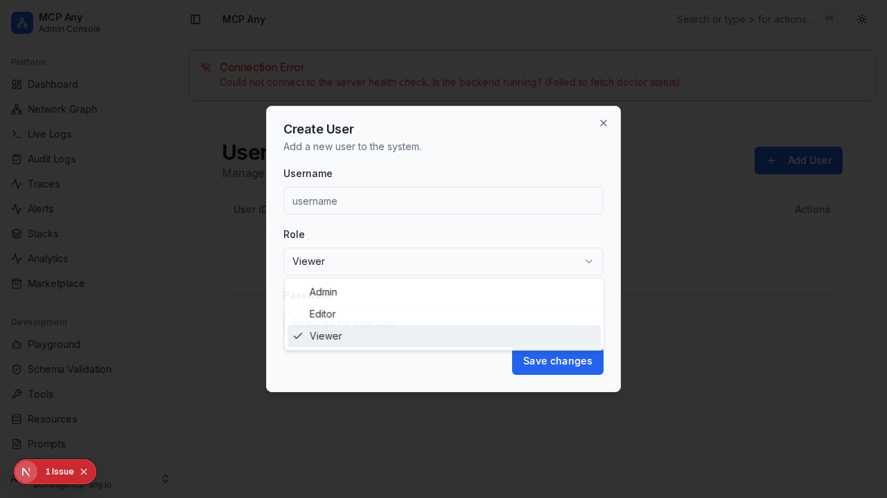

# User & Role Management

MCP Any provides a comprehensive user management system allowing administrators to control access to the platform.

## Key Features

-   **Role-Based Access Control (RBAC)**: Assign specific roles to users to limit their capabilities.
    -   **Admin**: Full access to all settings and configurations.
    -   **Editor**: Can modify services and tools but cannot manage users.
    -   **Viewer**: Read-only access to logs and status.
-   **API Key Generation**: Securely generate API keys for service accounts or programmatic access. Keys are generated client-side and only shown once.
-   **User Management**: Create, edit, and delete users via a simple interface.

## Screenshots

## Usage

1.  Navigate to **Settings > Users**.
2.  Click **Add User** to create a new account.
3.  Select a **Role** (Admin, Editor, Viewer).
4.  To generate an API Key for a user, click the **Key** icon in the user list.
