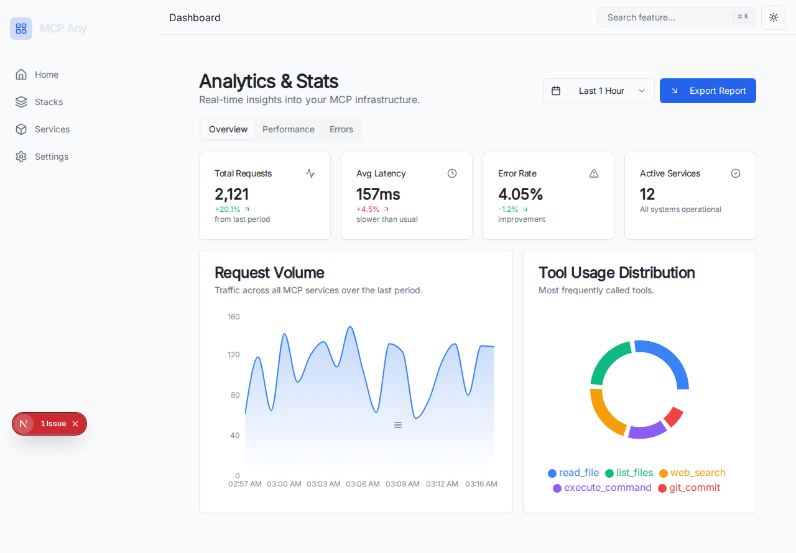

# Stats/Analytics Feature

**Date:** 2025-12-30
**Status:** Implemented

## Description
The Stats/Analytics feature provides real-time insights into the MCP infrastructure. It includes a dashboard with key metrics such as total requests, average latency, error rate, and active services.

## Components
- **AnalyticsDashboard:** The main component that renders the dashboard. It uses `recharts` for data visualization.
- **Charts:**
  - **Request Volume:** An AreaChart showing traffic over the last 24 hours (configurable timeframe).
  - **Tool Usage Distribution:** A PieChart showing the most frequently used tools.
  - **Latency Trend:** A BarChart showing average response time.
  - **Error Trend:** A LineChart showing the number of failed requests.
  - **Error Types:** A list of error categories with their distribution.

## Mock Data
The dashboard currently uses mock data generated on the client side to simulate a realistic environment.

## Screenshots

